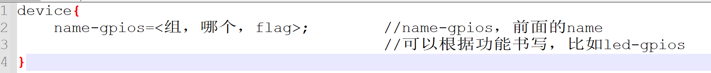

## 驱动开发环境搭建
1. linux技术简说
2. imx6ull pro
3. hi3516d300

## GPIO子系统
1. gpio设备树书写方法  
  
* 组是通过gpio_controller去配置的，每个gpio_controller在设备树中也是有节点的
* gpio_controller节点中还有个属性，叫做：gpio-cells=<x>,x是整数,表示需要指定x个整数来确认
* 
* 

2. 

## PinCtrl子系统
1. 概念介绍
*  
* 
2.
* 
* 

3. 资料
* 《内核Documentation\devicetree\bindings\Pinctrl目录下Pinctrl-bindings.txt》
* 《内核Documentation\gpio目录下Pinctrl-bindings.txt》
* 《内核Documentation\devicetree\bindings\gpio目录下gpio.txt》
* 《韦东山相关设备树视频》
* 其余搜索引擎上的资料
* 

## 异常与中断

## Mmap