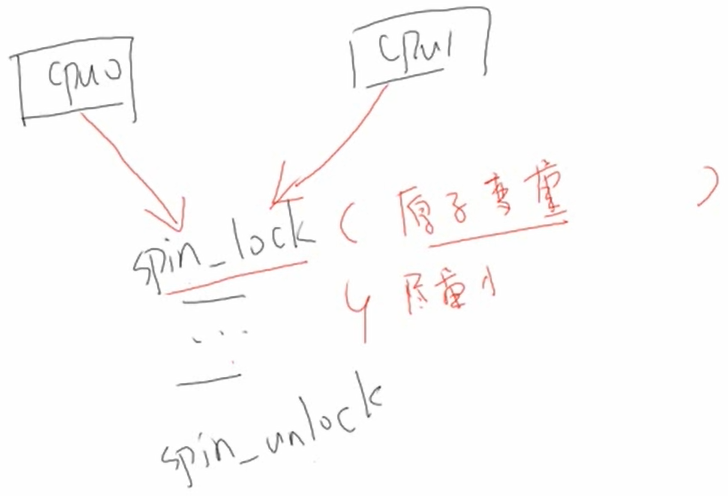
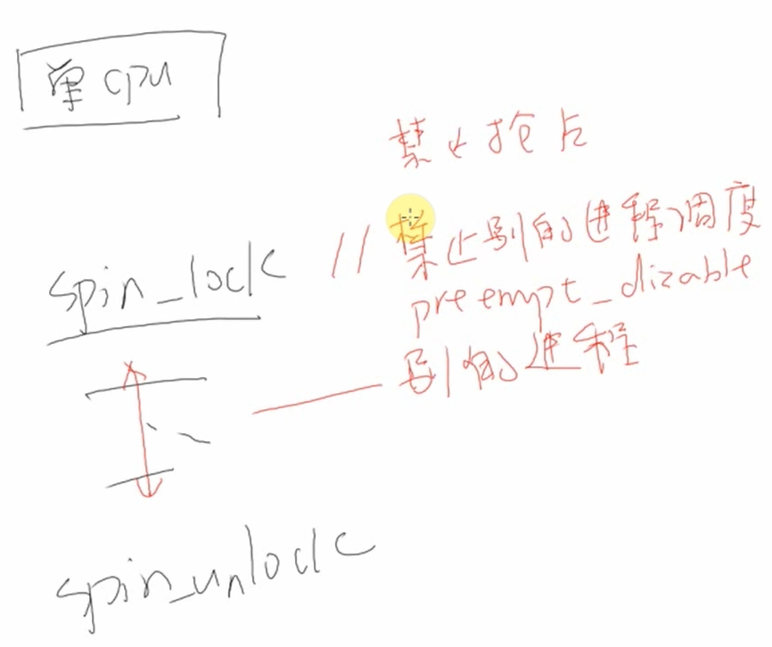
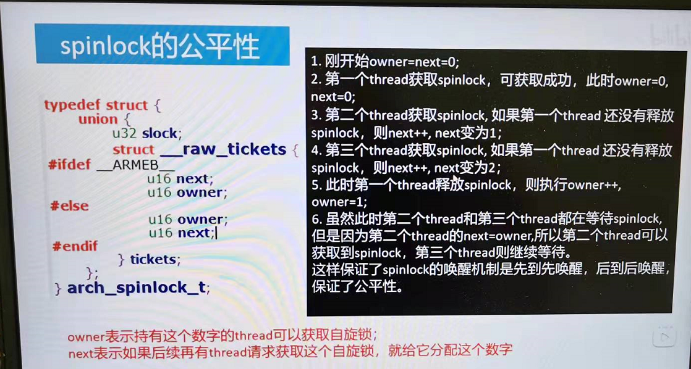

## 概念
* 原子操作 atomic  
> 概念  
atomic,

> 内联汇编  
即在C函数中使用汇编代码

> 

> 
* 信号量 
> 概念:  
1. 用于资源同步
2. 
* 互斥锁 

 

## 内联汇编
1. 

## 锁的分类
* 自旋锁 
> 概念：  
1. 原地打转，不休眠  
> 特点  
1. 是一种死等的锁机制
2. 只有一个执行单元获取锁并进入临界区域，其他执行单元都会在占用cpu不断的死等
3. 执行时间短。正是由于第三点原因，所以我们临界区的代码必须很短，否则cpu浪费就会很严重。
4. 可以在中断上下文中使用(中断上下文不允许睡眠，不允许调用可能引起睡眠的函数，所以不能使用信号量等锁，只能用spin_lock)。 
> 场景：  
1. 为了解决在多cpu系统中，如何互斥访问临界资源;  
2. 且临界资源代码少，运行比较快的场景。 

> up和smp的区别  
1. smp存在自旋功能，当一个cpu占用时，它在自旋(不休眠)，其余cpu无法抢占
2. up没有自旋功能，因为只有一个cpu，spinlock功能退化了  

多cpu：  
  

单cpu：  
  

> 相关接口  
1. spin_lock 进程与进程之间的同步(和信号量一样)
2. spin_lock_bh 涉及到与本地软中断之间的同步
3. spin_lock_irq 涉及到与本地硬件中断之间的同步
4. spin_lock_irqsave 涉及到与本地硬件中断之间的同步并保存本地中断状态
5. spin_trylock 尝试获取锁，如果成功返回非零值，否则返回零  

> spin_lock的公平性  

 

> spin_lock源码解读(up版)  
1. 
2. 
3. 

> spinlock smp源码解读  

static inline void arch_spin_lock(arch_spinlock_t *lock)
{
	unsigned long tmp;
	u32 newval;
	arch_spinlock_t lockval;

    /* 关闭抢占 */
	prefetchw(&lock->slock);
	__asm__ __volatile__(
"1:	ldrex	%0, [%3]\n"
"	add	%1, %0, %4\n"
"	strex	%2, %1, [%3]\n"
"	teq	%2, #0\n"
"	bne	1b"
	: "=&r" (lockval), "=&r" (newval), "=&r" (tmp)
	: "r" (&lock->slock), "I" (1 << TICKET_SHIFT)
	: "cc");

	while (lockval.tickets.next != lockval.tickets.owner) {
		wfe();
		lockval.tickets.owner = ACCESS_ONCE(lock->tickets.owner);
	}

	smp_mb();
}

 

* 睡眠锁
> 概念:  
1. 得不到锁就睡觉，需要使用时别人来唤醒我  
> 分类:  
* 信号量特点  
1. 可以在不同进程获得和释放  
2. 允许有多个进程进入临界区代码执行
3. 获取不到信号量时，进程会进入休眠释放cpu资源
4. 被信号量锁保护的临界区代码是允许睡眠的
5. 单核或者多核的cpu针对信号量实现是一致的(基于进程调度器)
6. 不支持进程和中断之间的同步  

* 互斥锁特点
1. 只能在当前进程获得和释放 
2.  

 

## 锁使用场景
* 锁类型1
1. 
2. 
* 锁类型2
1. 
2. 
 

## 源码分析

 

## 案例

 

## tips
1. Linux硬实时补丁里面，spinlock被重新定义，spinlock能够睡眠，raw_spinlock还是不能睡眠的。
2. 

## 问题
1. 二值信号量和互斥锁的异同？
2. 
3. 

## 资料说明
1. 《简说Linux视频》
2. 《韦东山Linux驱动大全视频》